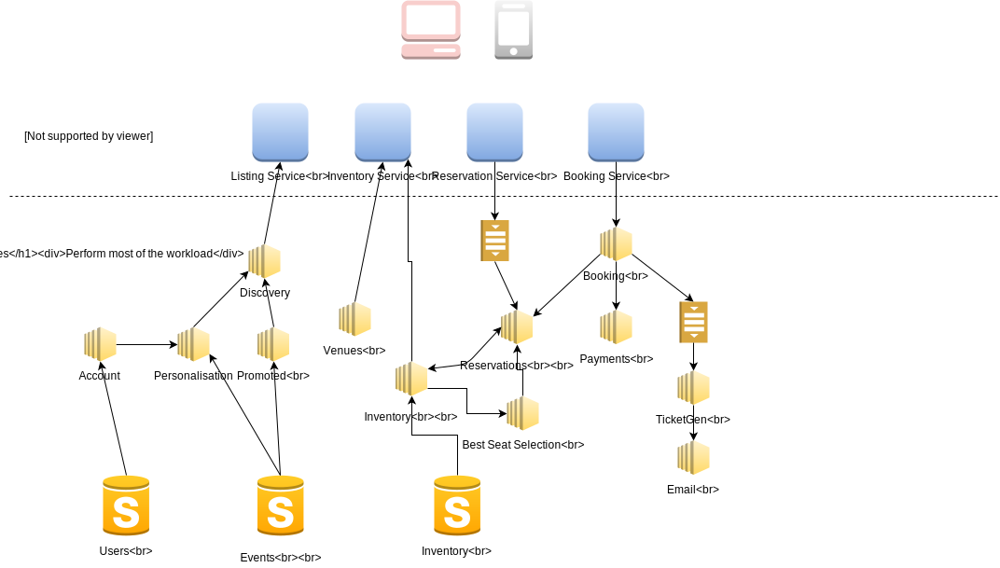
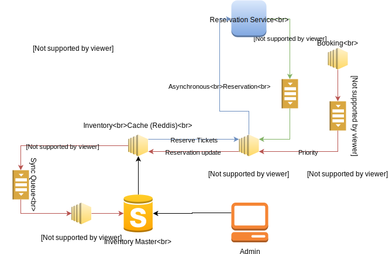

# Tickets Microservice

A ticketing application built on microservices

#### Components
* Web App
* Rest APIs
* Database
* Services (see more below)

#### Services
* Featured/Promoted/Personalisation
* Listings + search
* Inventory
* Venue
* Reservation
* Account
* Payment
* Notification (email)
* Ticket generation

### Architecture

#### Reservation System

Reservations have an initial time limit and a max time limit. Reservations can be extended by progressing through the booking process up until the max is reached or the reservation is cancelled or completed.

This is somewhat of a CQRS architecture. The reservation service reads in two queues, the reservation creation queue and the reservation update queue. This service could be a singleton, ensuring no need for concurrency checking but with the cache should be able to serve requests fast enough. The update queue takes priority to ensure that users with reservations are processed first. 

Completed reservations update the cache and then sync back with the master database via a queue.

##### Reservation Tokens
A signed token (JWT) should be issued with each reservation that can be used to determine the timestamp and contents of each reservation. This means we don't need to keep updating the reservation record on the cache when extending the reservation. The reservation can be re-signed and sent back to the client.

##### Expired reservations
We now face the challenge of how do we reissue tickets in an expired reservation

##### Reliability
###### Reservation Manager
If the reservation manager has a transient outage (e.g a georedundancy fallback), the queues may fill up momentarily with reservation messages

